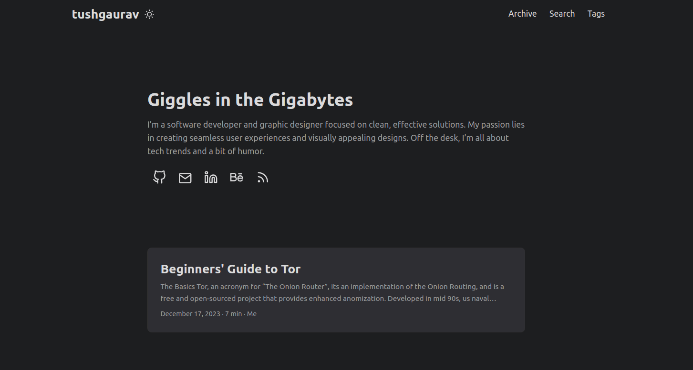

# Tushar's Personal Blog

## About
This repository contains the source code for tushgaurav.in, a personal website built using Hugo. The website contains my blogs on various topics ranging from Tech to Travel.

## Tech Stack
- **Framework**: Hugo
- **Languages**: HTML, CSS, JavaScript
- **Design**: PaperMod Theme
- **Deployment**: GitHub Pages
- **Comments**: [Cactus Comments](https://cactus.chat/)

## Local Development
Make sure that you have Hugo installed already.
To run this project locally:
1. Clone the repository: `git clone git@github.com:tushgaurav/tushgaurav.in.git`
2. Navigate to the project directory: `cd tushgaurav.in`
3. Run Hugo server: `hugo server`

## Contributions
Contributions are welcome. Please open an issue to discuss your idea or submit a Pull Request.

