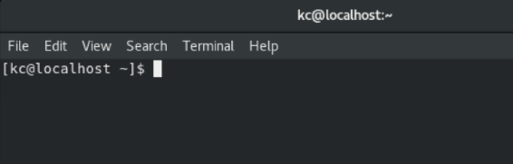
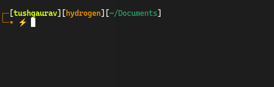
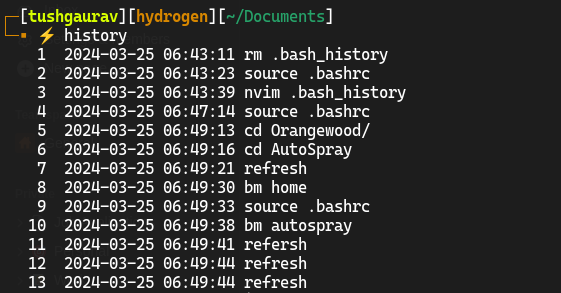

In this tutorial, we will examine some ways in which we can make our bash shell appear much more personal

### What is bashrc?

bashrc (stands for bash read command) is a hidden file that is present inside a user’s home directory. bashrc is a configuration file for the bash shell. Each time we open a bash environment the bashrc loaded into the current environment and is executed once. This is the time when the configuration from the bash file is read and added to the current environment.

Here are some changes that you would like to make -

- Change the default bash prompt.
- Change bash history length.
- Add command aliases.
- Enable vim mode in the terminal.

If you don’t have a .bashrc file in your home directory you can simply create an empty file named .bashrc and follow along with this article.

### Bash Prompt

Bash has several prompts that can be customized to suit a user’s need. There are 5 bash prompts (PS0 to PS4), each of these prompts has different functions and is displayed at different locations and states. We are going to focus on PS1 which is the text that is displayed before each command that you type in bash.



This PS1 is defined as a variable in your bashrc file. You can easily customize this variable to add more information to your bash prompt like time, IP address of host (if you use ssh frequently to remote to servers, this could be useful), etc. Here is a typical PS1 

```bash
PS1="[\d \t \u@\h:\w ] $ "  
# Displays: [Sat Jun 02 14:24:12 tushgaurav@server:~ ] $
```

Instead of changing this variable by hand and memorizing what each letter means, you can use various prompt generators that are available online such as [ezprompt.net](http://ezprompt.net/). 

Here is my bash prompt with styling which is a theme from OhMyBash (discussed later).



### Bash History

Bash maintains a history of commands that were executed previously. This allows users to enter the previously used commands without typing them again and it also acts as a remainder for users to see what command they run previously. To view your bash history you can type the history command. The default history size is 500 commands.



Your bash history is saved in .bash_history file at the user home directory, so if you ever wanted to empty your bash history you could simply delete that file.

Some simple changes that people like to make to their bash history are these

```bash
HISTSIZE=HISTFILESIZE     #Infinite history
HISTCONTROL=ignoreboth    #Don’t save duplicates
```

### Aliases

Bash aliases are essentially shortcuts that save you from typing long commands. You could define your aliases in the bashrc file, Here is how you can add your aliases.

```bash
# Aliases
# Syntax: alias <alias>="<full command>" 
                    
alias vi="nvim"                 
alias vim="nvim"                
alias refresh="source ~/.bashrc"
alias ls="ls -l"                
```

### Vim Mode

If you are a Vim user (congratulations), you are going to love this. Have you ever wanted to change the long command that you just typed in the terminal without using your mouse or arrow keys, you could enable vim mode and use vim commands in the terminal itself. Just add this to your bashrc and after that when you press the escape key to enable vim mode. You can use the standard vim keybindings and shortcuts to edit the command, you could also type vi to open a vim editor and edit your command there. This feature if very useful. 

```bash
set -o vi  #Enable vim mode
```

### OhMyBash

OhMyBash is a bash configuration manager that is very easy to set up and customise. OhMyBash’s best feature is its huge library of themes, it comes with over 100 themes!. You can easily change the theme by changing a variable in your bashrc. It also comes with its’ own plugin manager. It also adds a few well-thought-out aliases and makes good changes to your bashrc file.

You can easily set up OhMyBash by following the instructions mentioned in the official GitHub repository.

[https://github.com/ohmybash/oh-my-bash](https://github.com/ohmybash/oh-my-bash)

In summary, if you want a good bash configuration in no time, this comes in handy.