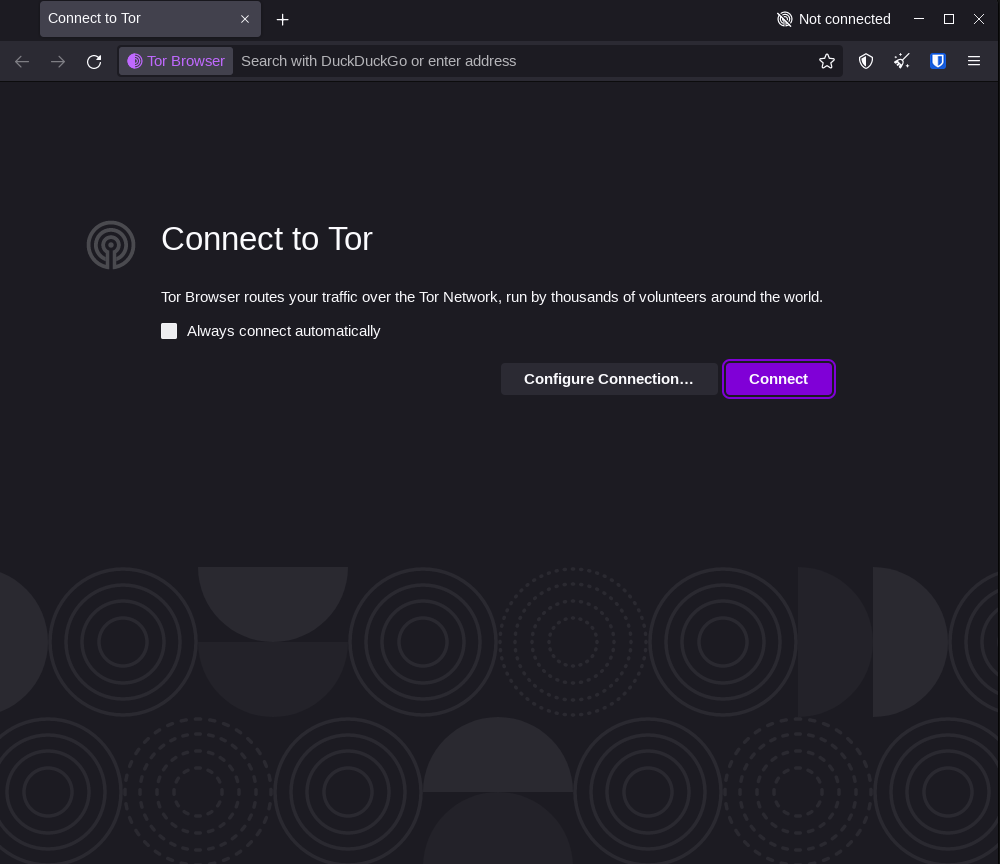

## The Basics

Tor, an acronym for “The Onion Router”, its an implementation of the Onion Routing, and is a free and open-sourced project that provides enhanced anomization.

Developed in mid 90s, us naval research, it bounces around connection between different routers so it is much harder to track.

Tor in its implementation uses three hops or nodes or routers and multiple layers of encryption to bounce around connections, the last node which is also called a exit relay is usually the one which visits the website/service requested, you can think of it like a proxy with much more anonymity as the exit relay only knows the service that is requested not the actual person requesting the service. look at this picture

The clever thing about the TOR or Onion Routing is that no one in the network knows anything about the whole connection. The relay or nodes only know who sent them the packets and where to forward the packets.

## TOR Working?

The client which wants to communicate over the TOR network picks up three nodes at random, these nodes are also called as relays or routers. These nodes can be a dedicated server in a data center or can be a simple desktop or laptop. This small network of three nodes is called a Tor Circuit. The client then uses some key sharing algorithm like Diffe Helman to share three keys between the (three) nodes. The benefit of using this “key sharing “ algorithm is that no one can know what keys we have shared over the network, this is the beauty of the algorithm. You should really look into how this algorithm work and how clever it is, I bet you will find it very interesting. 

Let’s suppose these keys are K1, K2 and K3 and each node (N1, N2, N3) only knows one key. TOR essentially shares messages encrypted multiple time by these keys over these nodes using the shared keys in layers, each router receives the message and then uses its shared key to decrypt it and then pass it along the next node in the TOR circuit. These messages are called Data Packets in Tor terminology. The messages are typically divided into these smaller data packets cells which is 512 bytes each in size. There can be multiple types of data or messages that can be transmitted over the Tor network like Control Messages and Routing Information.

### How this encryption works?

Suppose there are three nodes N1, N2 and N3. We have used some key sharing algorithm to share a keys K1, K2 and K3 between these nodes. Now when we are sending a message we encrypt the message using the keys K3, K2 and K1 one after another in layers so that when the message is received by the node N1 with the key K1, it can decrypt the message to see where to forward it. It can only see this and noting else, since the rest of the message is also encrypted two times (by key K2 and K3). The node then send the message to node N2 and this node also performs the same process. Now when the message is received by the last node (called exit relay) it can see the whole message (for example visit to wikipedia.org). This node then communicates with the server and fetches the requested information and then this whole process is reversed and the message is once again encrypted and then send to N2 by N3 and then again encrypted by N1 and send to our computer and then we can finally decrypt the whole message and see the requested information. This encryption and decryption results in usually slower speeds as compared to the regular “clear net” internet.

## Tor Relays

Tor network relies on volunteers running relays and donating their bandwidth. The more people who run relays, the better the Tor network will be. Currently the Tor network is very small as compared to the people who are using it. (There are about 8100 relays as of Oct 2023 while there are more than 4 Million active users on Tor)

We have already looked at what a Tor circuit is, A Tor circuit is the combination of few different types of relays. These are 

- **Guard Relay** - It is the first relay in the chain of the 3 relays which builds a Tor circuit.
- **Middle Relay** - It is neither a guard nor an exit, buts acts as a second hop between the Guard Relay and the Exit Relay.
- **Exit Relay** - It is the final relay in the Tor circuit, the one that sends traffic out to its destination.

All these relays are listed in the public list of Tor relays.

## Who uses Tor?

Tor can be used by people of varing motivations and intentions. The old myth that accessing the Tor is illegal is merely a hoax as the Tor is it self created by the US Naval Research (employees Paul Syverson, Michael Reed and David Goldschlag in the mid 1990s). It was developed to protect American intelligence communications online.

> Tor Project was formed in December 2006. Its purpose was to advance human rights and freedoms by creating and deploying free and open source anonymity and privacy technologies. As a not-for-profit, TOR relies on donations from a wide range of organisations. To date it has received more than 4300 personal donations. Donors include Reddit, Free Radio Asia and an anonymous northern American internet service provider. US Government departments including the US Bureau of Democracy, Human Rights and Labour continue to provide funding.
    

Tor is used widely by Whistleblowers, journalists, activists, security researchers and privacy consisous individuals like you and me.

## How to use Tor?

To use TOR in your personal computer you need to install a browser called the Tor Browser which is a customized Firefox fork. You can download the Tor browser from the official website of the Tor Project or through this link -

[https://www.torproject.org/download/](https://www.torproject.org/download/)

Just download and install the browser as per your operating system. Once you open the browser you will see option to Connect. 

Clicking the **Connect** button will pick up a random TOR circuit. Now you will be connected to the TOR Network.

### What are the security problems of the Tor network?

There can be some attacks on the Tor network which can potentially deanomize a user. Some of them are as follows -

As we know that the traffic leaves the exit node and then merges with the regular internet and if this traffic is not encrypted or is plane HTTP traffic anyone packet sniffing here could see the messsages send/recieved. Also when a user logs into their personal accounts on the destination sites such the identity of the user is obisully reaveled to at least the site which the user logged in.

Traffic analysis and User Behavior analysis techniques can be used to tie the Tor and the regular internet traffic  to de-anonymize Tor users. User Behavior analysis depends on the activities of users while the Passsive Traffic analysis depends on the unique parameters to identity users such as operating system version, installed patches, screen resolutioin, time zone and many more properties. If these combinations appear in both Tor and regular internet, it could be possible to tie these two users.

## Your Own TOR Relay

As we know that the Tor project relies on the individual contribution from the community for the bandwith and the general functioning of the newtork. 

If there are many different individually controlled nodes by diifferent people, it will not only make the network fast and reliabe but it will also become more secure as the possibilty of a single person or a group of persons controlling the nodes will be much lower and the traffic corelation will be much lower.



### Tor Hidden Services AKA The Dark Web

A lot of what happens on Tor is illegal, but the majority is legal.

When we are using the Tor and browsing the normal internet, the servers are situated outside the Tor network and we are just forwarding our connections through the Tor network to that server to anonymize  ourselves, but in case of a hidden service the server, is also a Tor node inside the tor network, at no point of time the connection leaves the Tor network, making the connection much more secure and harder to intercept.

The hidden services ends with a .onion domain instead of the regular .in or .com domains that we see on the regular internet.

Here is my personal hidden service -

[http://tusharrj5qxntyhryc2mjedltzgi5vufewt5rnp2xhfswl27svzapayd.onion/](http://tusharrj5qxntyhryc2mjedltzgi5vufewt5rnp2xhfswl27svzapayd.onion/)

### Further Reading:

These are some of the best videos that I have watched explaining what TOR is and how TOR hidden services work.

#### Computerphile's How Tor Works


#### Computerphile's Tor Hidden Service
