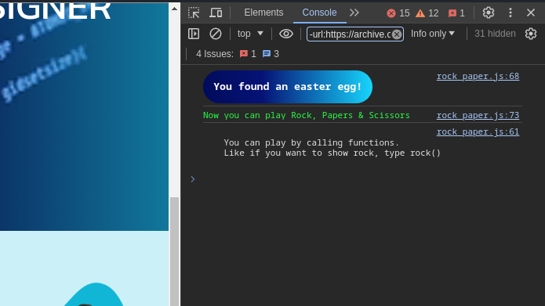

Each year, I try to update the tech stack behind my website and try to switch things a bit. Doing so makes my website feel like new and keeps me updated on the new tech trends. I have been doing this for three years and each year I tend to make my website more and more complex but this year I decided to change things a little bit. I tried to simplify things. 

I wanted to make my website as simple as possible. I wanted it to be simple and modern without sacrificing performance.

You see making websites does not need to be complex. Sure, if you want to do a particularly unique idea then you should not focus on simplicity rather you should focus on the idea itself. But for most people or simple use cases like myself, I just want a simple website that will tell the visitors about myself and has some place for my blogs (which I sometimes write).

## Web Development Spiral

We started with simple websites built using HTML, CSS, and JavaScript that have the static content (HTML Pages) generated and stored on the server and are ready to serve the client.

Then came React and client-side rendering and it shifted the web development paradigm completely. Now everything was an SPA (Single-page application). Today’s SPAs are built using frameworks such as React, Vue, and Angular. 

These frameworks just ship a blank HTML file and a JavaScript blob to the client and make them parse and render the content. It allowed for great user interaction control and made apps similar to native mobile and desktop applications in terms of interactivity.

Then came [SSR](https://vuejs.org/guide/scaling-up/ssr.html) (Server-side rendering). SSR addresses the performance and search engine optimization issues of single-page JavaScript applications. In contrast to client-side rendering, it generates static content on the server before sending it over to the user’s browser. It improved the [Core Web Vitals](https://support.google.com/webmasters/answer/9205520?hl=en) scores and made websites a lot faster.

## My Web Development Journey

### The Simple: HTML, CSS & JavaScript

You can achieve a lot while going plane simple. Here is what my first personal website looked like.



A bit plane right?

I was just straight-up hard coding everything in HTML and using a few JavaScript libraries but I was not using any framework, for example, I was using [VantaJs](https://www.vantajs.com/) for the background animations. The design self made on Figma. 

The footer showed a random funny computer science quote each time the website was rendered. 

The website was fast and everything was cached using [Cloudflare](https://www.cloudflare.com/en-gb/application-services/products/cdn/) CDN. But it became a bit of a chore to manage, every time I wanted to change something I had to manually find the text in the HTML file and edit it in several places and after I added a few more pages it became a nightmare. 

I was using GitHub pages for hosting and files such as my resume and other download files using an [Amazon S3](https://aws.amazon.com/s3/) bucket so, it was super fast.

### Version 2: Django



In the meantime I learned a few technologies, I got into Python and learned Django. So, I built my next iteration using Django as my back end. Also, this time my website had a proper back end and a database. I was using [PostgreSQL](https://www.postgresql.org/) to store my blogs and user accounts. 

It had a lot of features and I was very proud of my website for a lot of time. I added everything I knew at that time to the website, 3D models, animations, user-auth, blog, comments, file hosting, and whatnot. I also added a cool Easter egg game. Although I am not sure that anyone has found it I am now revealing it here. If you were ever to open the developer’s tool on my website at that time, you would see this -

You could play a game of rock, paper & scissors with the computer by typing out function calls.

I also made a mobile application to go along with my website, similar to all the fancy websites. Although it was a PWA (Progressive Web App), which makes it less special still I find it pretty exciting at that time that a visitor can go to my website and install it as a web app and read blogs on their devices using the app that I made. This seemed smart at that time, but now it sounds lame.

Talking about the design, I did all the design work myself. I first made the wireframe and UI design in Figma and tried to recreate it on my website. Here is the code base for my website.

I have designed the UI for my website on Figma and here is the project link 

<iframe style="border: 1px solid rgba(0, 0, 0, 0.1);" width="800" height="450" src="https://www.figma.com/embed?embed_host=share&url=https%3A%2F%2Fwww.figma.com%2Ffile%2FKMtZ59wy3dqcoJBKIvooaz%2Ftushgaurav%3Ftype%3Ddesign%26node-id%3D101%253A3%26mode%3Ddesign%26t%3DW0eYoh9IdAAk35Ay-1" allowfullscreen></iframe>

### Current Version: HUGO and Markdown



This time I went for a simple setup for my website. I used a [Hugo](https://gohugo.io/) and used a theme called [PaperMod](https://github.com/adityatelange/hugo-PaperMod). I am not using any database, the blogs are simply individual markdown files stored on the GitHub Repository. I am using GitHub pages for hosting. I went for a minimalist theme for my website.

Each time I want to publish a new blog (which I would do more of), I have to commit to the main repository and it will be live thanks to GihHub actions.

## How to get started in Web Dev?

Web Development can be a tricky path to navigate, If you want to get started on learning Web Development, I would suggest you to first start from the basics. 

Learn HTML, and make a few web pages using just HTML. Focus on proper syntax and follow the accessibility guidelines, try to maintain proper hierarchy in your content, and use tags to describe your content. For example, use the article tag to show an article followed by section tags to show a section inside your article. After you have done using this and have confidence in the HTML part. Move to CSS.

CSS is used to style your HTML. Start by learning the basics such as Classes, Selectors,  Box model, Flex Box, Grid, etc. Try to style the previously created web pages and then learn about web design. I am not saying that you need to be an artist but your fundamentals should be clear. A great resource for this is the CalArts [Graphics Design Specialization](https://www.coursera.org/specializations/graphic-design) and [UI / UX Design Specialization](https://www.coursera.org/specializations/ui-ux-design) courses on Coursera. These courses are available for free. It would help if you also learned how to use and make wireframes in Figma. Don’t use Adobe XD.

Now, after you have learned HTML and CSS. Let’s start with JavaScript. Start by learning basic syntax or if you have some coding experience you can start by solving some easy questions on Leetcode in JavaScript. It helps you to get used to the JavaScript syntax. 

After that learn about DOM manipulation using JavaScript. Learn some [Web APIs](https://www.w3schools.com/js/js_api_intro.asp).

After that, you can make good websites. These were the bare minimum. You may now start learning some web frameworks such as React, Angular, Vue, etc. Bob Ziroll’s [Learn React](https://scrimba.com/learn/learnreact) is a great course to get started with. It’s available for free on both [YouTube](https://www.youtube.com/watch?v=bMknfKXIFA8) and [Scrimba.com](https://scrimba.com/).

You also need to learn how the web works and the basics of computer networking. It’s not mandatory but should help you in building and debugging websites.

After you have learned a framework, you should now begin learning how to integrate a database into your web apps, learning a backend framework can be an option or you can instead just learn a full stack framework such as [Next.js](https://nextjs.org/) or [Django](https://www.djangoproject.com/).

### What if you don’t like to code?

There are plenty of no-code solutions available to get started. My recommendation is to learn [WordPress](https://wordpress.org/). It’s free and open-sourced, easy to use and everything that you want to do is available as a plugin probably. It’s not the best in terms of security or performance but it gets the job done quickly. There are lots of free themes to choose from and millions of websites use wordpress. You can easily set up an online store and sell products.

Another great option is to use [Webflow](https://webflow.com/). Webflow is becoming the standard no-code solution for building websites.

## Three Fundamental Rules

The web development scene is evolving day by day but these remain constant. These three fundamental rules of web development remain constant even as the scene evolves.

1. HTML is fundamentally responsive.
2. Keep it simple, web design is like minimalism - less is more.
3. You don’t need to optimize for SEO. If your content is good, it will come automatically.