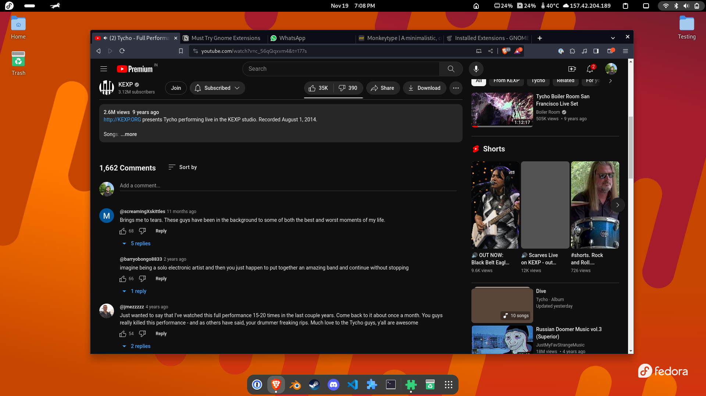
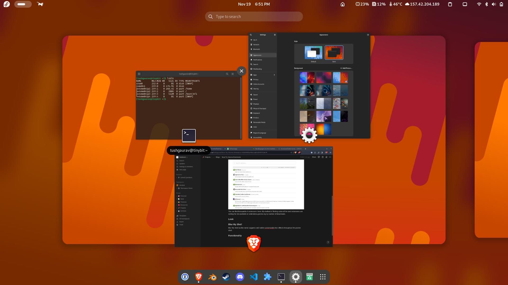
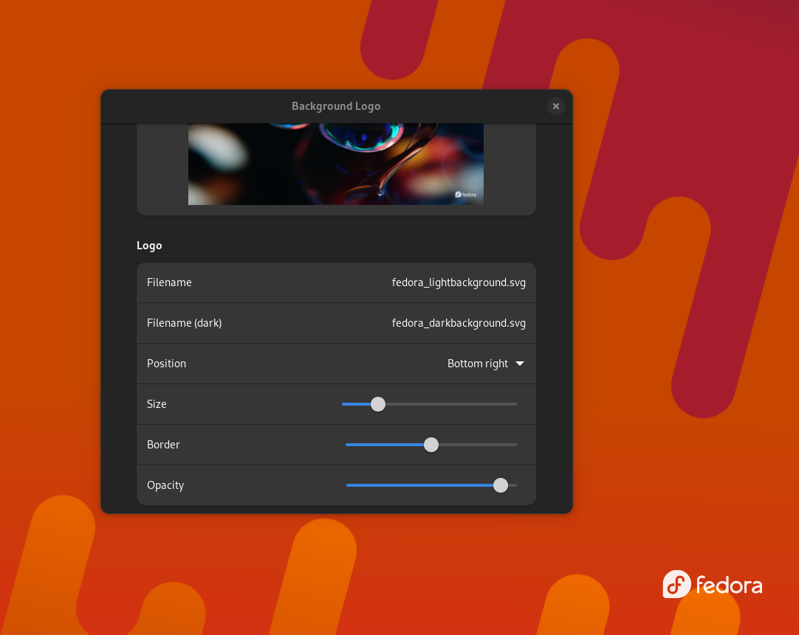
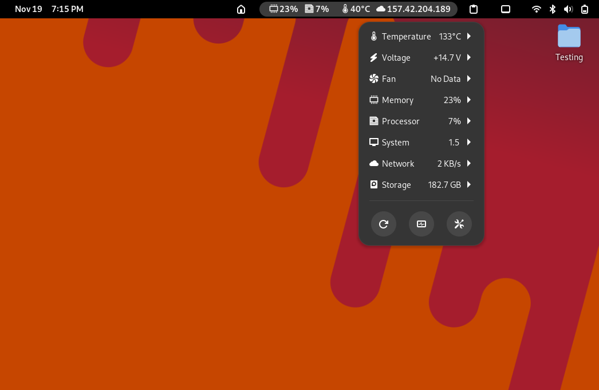
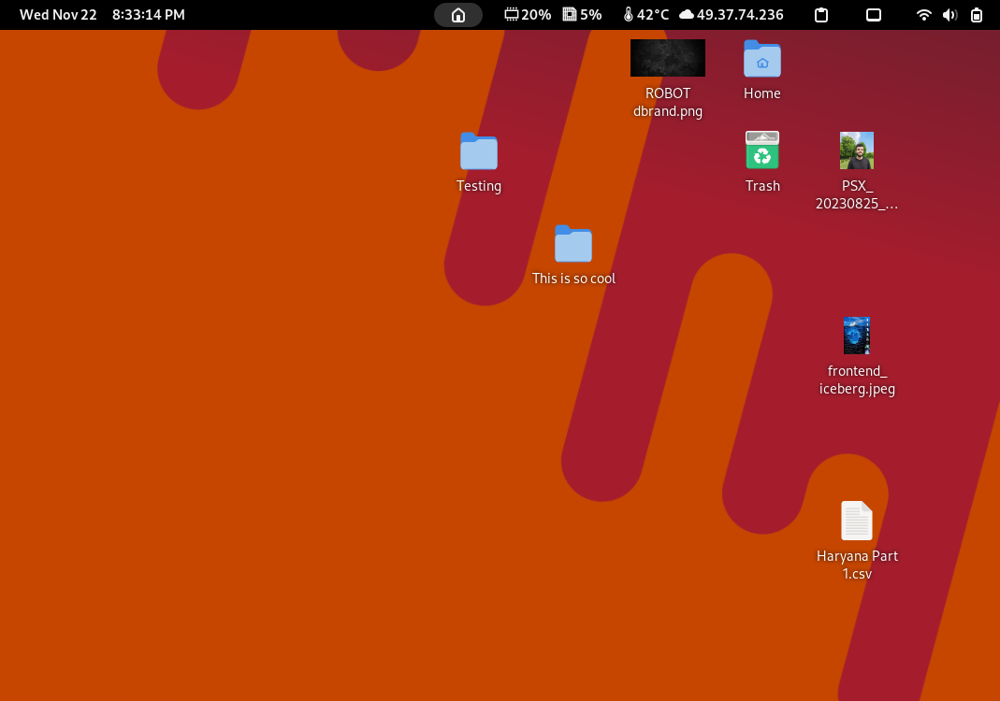
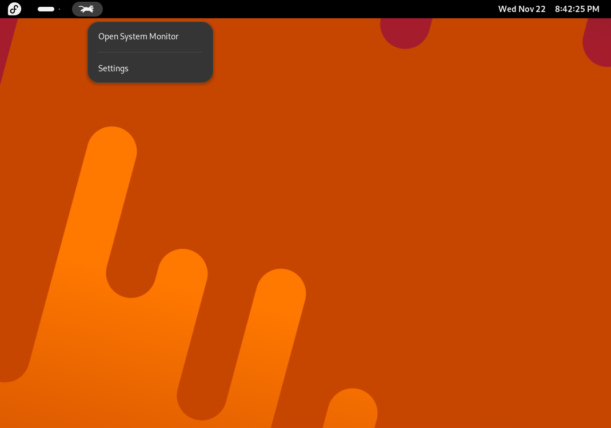
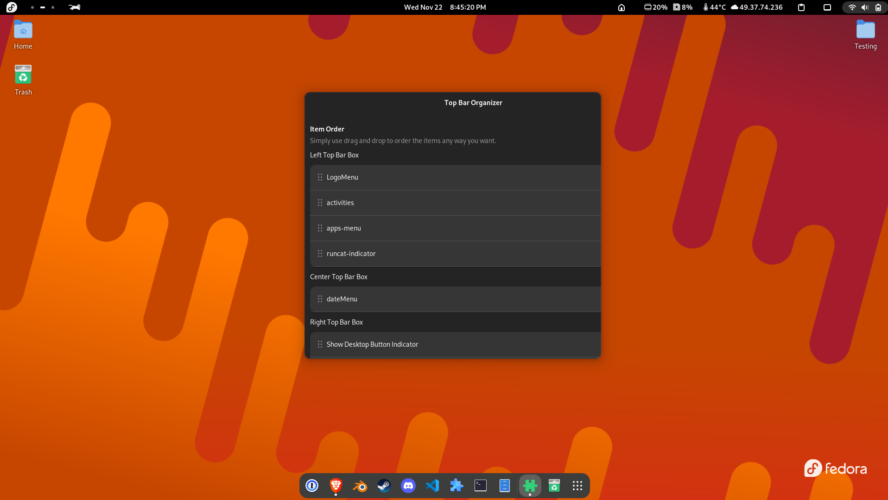
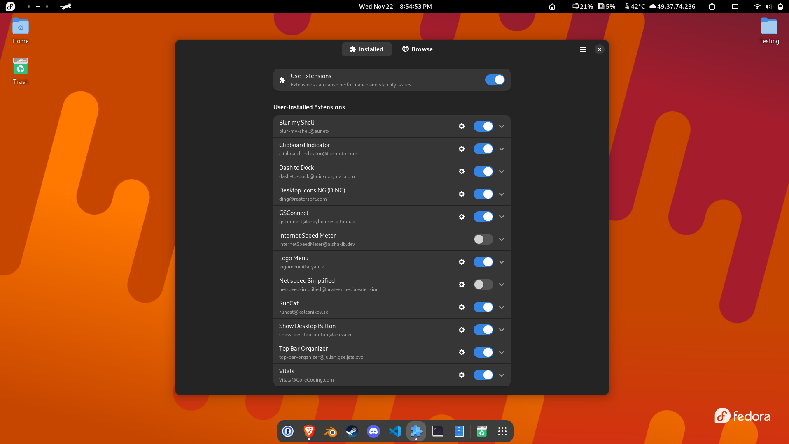
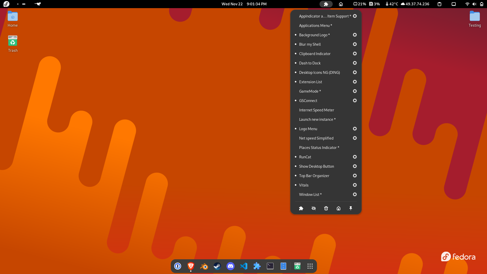
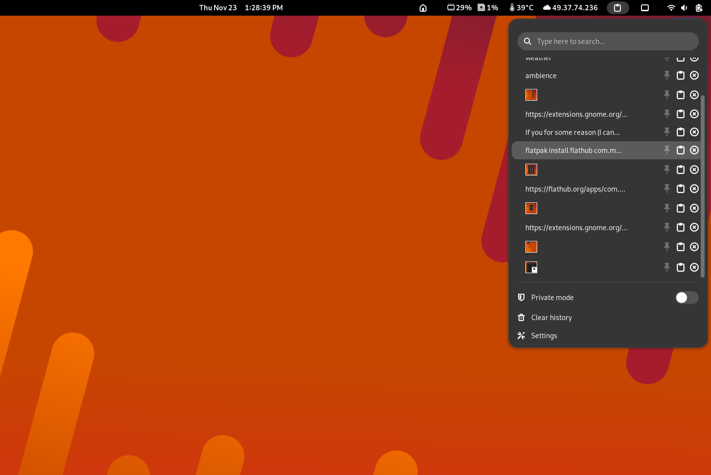

Gnome is one of the most popular desktop environments available. It’s popular for simple look which comes out of the box. Gnome looks beautiful on itself without any customisation.

However, you can make your Gnome desktop more personalized and add more functionality by using these extensions from the list. I have tried hundreds of extension and after time have compiled this list of some of the most useful extensions I have found.

## What is a Gnome Extension?

Extension as the name sounds are small programs that are installed to extend the functionality or the look of the standard gnome shell experience. 

The standard way to install and find gnome extensions are from [extensions.gnome.org](https://extensions.gnome.org/). 



You can find thousands of extensions there. My method of finding some of the best extensions are sorting the list available on extensions.gnome.org by number of downloads.

## Looks and Customisation

### Dash To Dock

[Dash to Dock - GNOME Shell Extensions](https://extensions.gnome.org/extension/307/dash-to-dock/)

Dash to Dock makes you customisation your dock as per your liking. You can make your dock look like a taskbar, your more like a MacOS dock. I have personally set it to automatically hide when I have full screen apps and show rest of the times.



You can pin your favourite apps on the dock now. For some reason this feels more natural than the stock gnome dock experience.

### Blur My Shell

[Blur my Shell - GNOME Shell Extensions](https://extensions.gnome.org/extension/3193/blur-my-shell/)

Blur My Shell as the name suggests add subtle customisation blur effects throughout the gnome shell.

This extension makes the shell look a little bit more professional and pretty. You can change the amount of the blur. The blur can be customised for the title bar and the shell separately.



### Background Logo

It adds a small logo to your desktop screen. You can add any logo to customise the look of your desktop such as adding your signature or something simple as your distribution’s logo as I have added here.



### Vitals

[Vitals - GNOME Shell Extensions](https://extensions.gnome.org/extension/1460/vitals/)

Vitals add your system information such as core temperature, ram usage, CPU usage, network usage, etc. to your gnome top bar. I thinks that this makes taking a quick look at your PC performance much more easy. 



### Desktop Icons NG

[Desktop Icons NG (DING) - GNOME Shell Extensions](https://extensions.gnome.org/extension/2087/desktop-icons-ng-ding/)

This extension as the name implies add the much loved Desktop icons to your gnome desktop. If you are coming from Windows or Mac background, then you may be surprised to find that Gnome at its core don’t support desktop icons. This is the perfect solution in that case. 

You may have used Ubuntu and have seen that it has desktop icons, how does Ubuntu have desktop icons if it uses Gnome desktop environment? Ubuntu comes with this extension installed out of the box.



The desktop icons can also render thumbnails for supported file types. It works flawlessly. There is also a context menu associated if you were to right click on the icons similar to other operating systems.

### RunCat

[RunCat - GNOME Shell Extensions](https://extensions.gnome.org/extension/2986/runcat/)

If you are like me you love cats and using cats to visualise the CPU usage seems like a unique idea. This is the extension for this job. It functionality is quite simple. It just shows a animation of cat running. This animation slows down and speeds up as your CPU usage increases or decreases. This is the perfect extension if you want to add some cat inspired touches to your top bar.



There is also a way to set up a threshold value for the CPU usage, and if the usage drops below that value the cat will sleep. How cute and well though out!

## Functionality & Tweaks

This category of extensions and applications don’t usually add any visual elements directly. These are usefully for enhancing or managing other icons.

### Top Bar Organiser

[Top Bar Organizer - GNOME Shell Extensions](https://extensions.gnome.org/extension/4356/top-bar-organizer/)

If you have added several extensions to the gnome top bar and you are not happy with the placement of the icons then this extensions comes in handy.



Using this extension you can click and drag the extensions and change their positions on the top bar. You can make the clock go on right instead of centre add the Application menu to centre and what not. The possibilities are endless. 

This is a must have extension if you want to tweak the positions of individual items on the top bar.

### Extension Manager

[Extension Manager | Flathub](https://flathub.org/apps/com.mattjakeman.ExtensionManager)

This is not a gnome extension per say rather a complete app (Flatpak). This app allows change individual settings of each installed extensions. You can unable and disable each extension from here. This also allows you to search for and install extensions directly from the app. This is a complete utility for gnome extensions. 



You can just type this command in your terminal to install this app from Flathub, provided you have Flatpak already installed.

```bash
flatpak install flathub com.mattjakeman.ExtensionManager
```

### Extension List

[Extension List - GNOME Shell Extensions](https://extensions.gnome.org/extension/3088/extension-list/)

If you for some reason (I can’t think of) don’t want to install a full on app to manage gnome extensions this is somewhat of a similar extension that you can use to manage other extensions.

It displays a list of the installed extensions in the top bar and if you click on the extension name you can toggle the extension on an off. You also have setting icons displayed next to each extension name, you can change the individual extension setting by clicking on them.



Also you can see a full list of installed extensions on my gnome desktop.

### Clipboard Indicator

[Clipboard Indicator - GNOME Shell Extensions](https://extensions.gnome.org/extension/779/clipboard-indicator/)

It’s a clipboard manager and stores all your previous copied items to your clipboard. It adds a small clipboard icon to the gnome top bar.



You pin your most important pastes, search between your clipboard history, delete them, or change the contents of your clipboard on the fly by selecting from one of the previously copied items.

#

These were some of my favourite extensions. If you have any extension that you want to add to this list please suggest changes. 