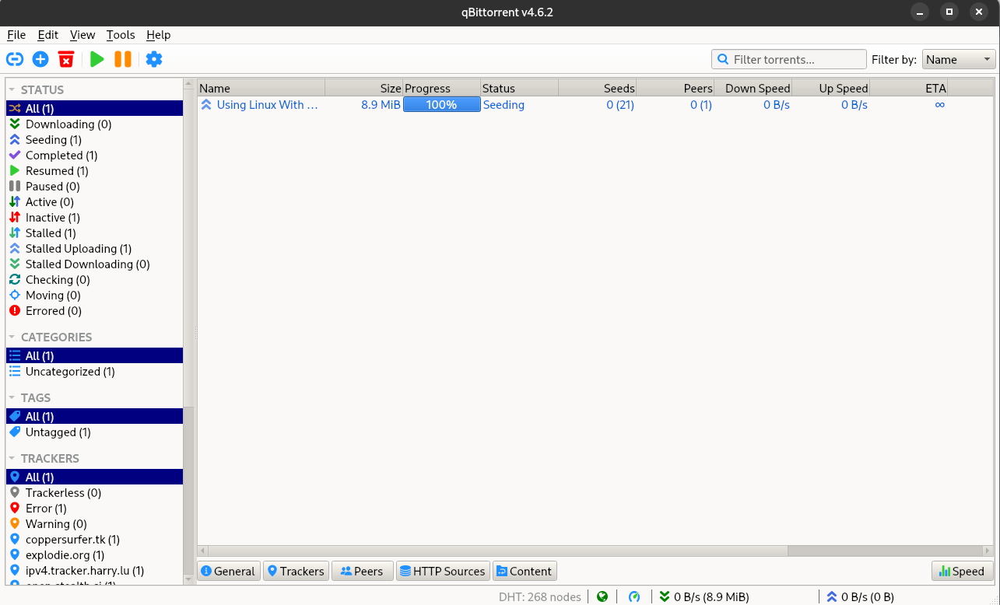
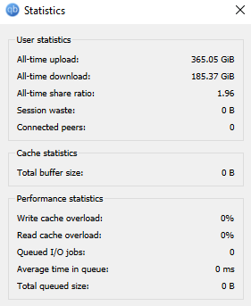
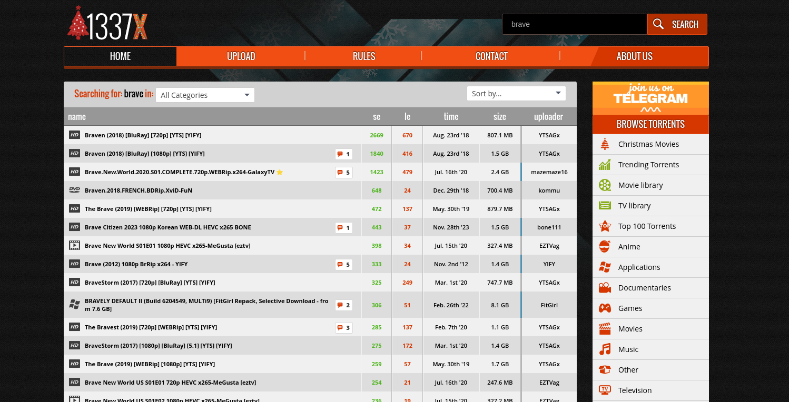
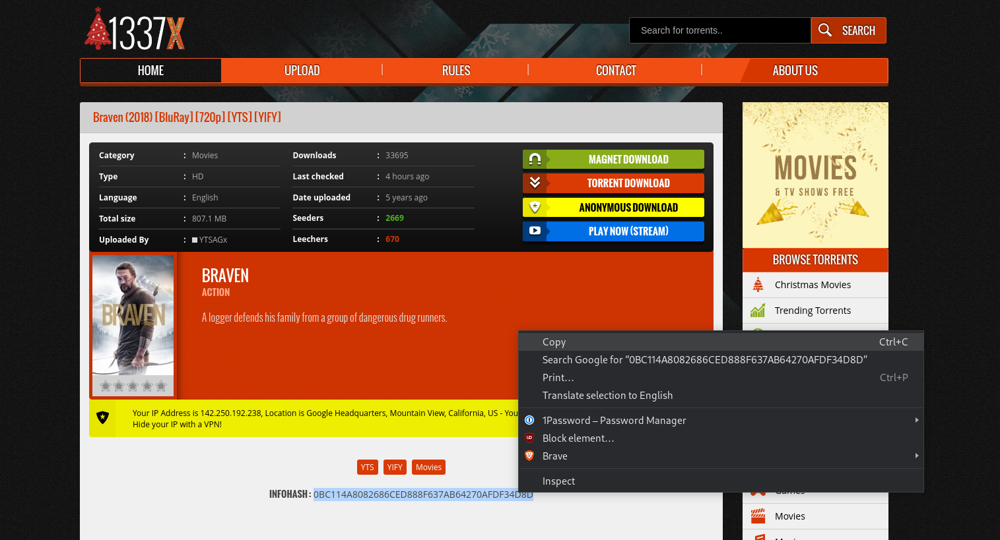
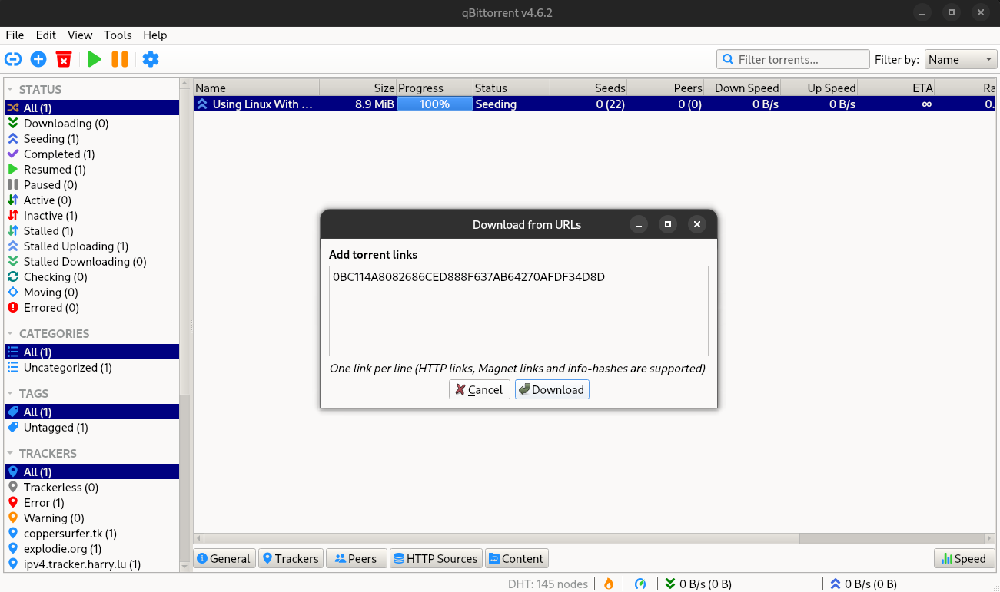

## What is Torrent?

**Torrent** (or more precisely ****BitTorrent****) is a peer to peer protocol for file sharing which involves having small copies of a file spread across multiple computers. It’s different from traditional file sharing as the files are not hosted on a central server. This comes with many benefits such as 

- Higher download speeds.
- Decentralised, no single entity controls the file.
- Highly resilient to Internet Censorship
- More economical way to host huge file downloads.

The act of downloading (and uploading) files over the BitTorrent network is called Torrenting.

### How does Torrenting works?

Torrenting involves breaking a large file into small pieces and distributing those pieces among multiple users who are also downloading the same file.

When someone wants to download a file through a torrent, they first need to download a small file called a torrent file (.torrent file) or they need a magnet link or a small string called the Infohash. These are mainly available from torrent search sites such as 1337x, The Pirate Way, etc.

This file contains information about the file being downloaded, such as the file name, size, and a list of servers (also called trackers) that facilitate the peer to peer sharing.

Once the torrent file is downloaded, the user opens it using a torrent client software, which then connects to the servers listed in the torrent file and begins downloading the pieces of the file from other users who have already downloaded the same file.

As the user downloads pieces of the file, they also upload pieces they have already downloaded to other users, allowing everyone to share the burden of transferring the file.

### Why use Torrents?

Torrenting has become popular because it can often provide faster download speeds than traditional methods of downloading files from a single server. This is because the bandwidth is not being bottle-necked by a single server, rather hundreds of small servers (user’s computers or seeders).

Torrents are also used for downloading and uploading of pirated content from cracked software to movies, shows, and much more. Banning a torrent is much more difficult as the files are distributed and are not hosted on any single server. You can effectively ban websites such as PirateBay and 1337x but these websites don’t host the torrents itself but are rather like a search engine and they only have the list of torrents. Many people have their own database of these “torrent lists” downloaded offline in the event of one of these sites getting banned.

## Torrent Terminologies

### Torrent Clients

It is a software used to download and share files via the BitTorrent protocol. Torrent clients allow users to connect to a swarm (a group or network) of other users who are sharing the same file.

These are some of the most popular torrent clients -

1. uTorrent - [uTorrent](https://www.utorrent.com/) (pronounced as ‘micro’ torrent not ‘u’ torrent) is a lightweight and popular torrent client known for its speed and ease of use. It’s drawback is that its free version contains adds and is not open sourced.
2. qBittorrent - [qBittorrent](https://www.qbittorrent.org/) is a free and open-source torrent client that offers a wide range of features and customisation options. I use this personally and highly recommend this to everyone.
3. Transmission - [Transmission](https://transmissionbt.com/) is a lightweight and efficient torrent client that is available for multiple platforms, including Windows, macOS, and Linux.

### Seeds

A Seed is a user who have already downloaded the entire file and is now uploading it to other users who are downloading it. They are the original source of the files on the network. They can provide all the necessary pieces to the other users.

The more seeds the torrent have the better the torrent health.

### Peer

A Peer is a user who is currently downloading and uploading the pieces of the file. Peers are users who are helping to share the burden of transferring a file with other users, and they can download pieces of the file from both other peers and seeds.

The more peers a torrent has the faster the download speeds.

> When a user downloads a file using a torrent client, they are not downloading the entire file from a single server, but instead, they are downloading it in small pieces from multiple other users who are also downloading or sharing the same file. Each of these users is a peer, and as a user downloads pieces of the file, they also become a peer and begin uploading pieces to other users who are still downloading the same file.
> 

### Leech

A Leech is a user who is downloading a file but not uploading it to other users. Leech takes advantage of the network without contributing any bandwidth to it.

#### You should never leech!

Leeching is generally considered to be poor torrenting etiquette since it can negatively impact the overall download speeds for other users who are also downloading the same file. This is because the more leeches there are for a particular file, the fewer users there are who are uploading the file to others, which can slow down the download speeds for everyone.

### Seed Ratio

Seed ratio, also known as seed-to-leech ratio or upload-to-download ratio, is a term used in torrenting to describe the amount of data a user has uploaded compared to the amount of data they have downloaded.

The seed ratio is expressed as a ratio of the total amount of data uploaded by the user to the total amount of data downloaded by the user. For example, a seed ratio of 2:1 means that the user has uploaded twice as much data as they have downloaded.

Seed ratio is important in torrenting because it helps to ensure that users are contributing to the P2P network by sharing the files they download. A high seed ratio indicates that a user is actively sharing the files they download, which helps to maintain the availability and download speeds of those files for other users.

You can see your seed ratio in your torrent client application. I personally try to maintain the seed ratio of 2:1.

### Trackers

A Tracker is a server that helps to coordinate the communication between peers on the BitTorrent network.

When a user downloads a torrent file using a torrent client, the client uses the information in the torrent file to connect to the tracker and obtain a list of other users (peers) who are currently sharing the same file. The tracker acts as a central hub for the torrent network and keeps track of all the users who are currently downloading and uploading the file.

As users connect to the tracker and begin downloading and uploading the file, the tracker updates the list of available peers and sends this information back to other users who are also downloading the file. This allows users to connect to each other directly and download and upload pieces of the file from and to each other.

Remember, Trackers does not store actual files rather they store the information about the torrents such as peers, seeds and sometimes leeches.

There are many popular trackers available such as The Pirate Bay, KickassTorrents, RARBG and 1337x which is my favorite one. It's also worth noting that the legality of using torrent trackers varies by country, and some trackers may be blocked in certain regions.

### Seed Boxes

A seedbox is a private server which uploads and downloads files over the BitTorrent network. 

People who have bandwidth restrictions or who don’t want to torrent files over their home network use a seedbox. There are many services offering seed boxes starting from INR 800 (about $10 USD). These seedboxes have access to very high speed networking. They are very popular in private trackers where the seed ratio needs to be 1.

## How to actually download a torrent?

Here is a step by step guide for the uninitiated.

1. Install a torrent client of your choice, you could also use some web based torrent clients that run online or in your browser like the one available with Brave browser.
2. Use a torrent search engine to find a torrent to download. It can be anything like Linux ISOs to some movies. I have to give you a warning here as downloading pirated content is most probably illegal where you live, but I know that does not prevented anyone from downloading them.
    
    
    
3. Find the torrent file or if you can’t find it copy the magnet link or infohash from the download page as shown below.
    
    
    
4. Now, go to the torrent client you have installed in the first step and find the option that says add new link or add torrent, and paste the copied code or link there. If you have downloaded the .torrent file, you could just simply open it inside the client. 
    
    
    

After you select the path to save the files, you files would start downloading, provided there are seeders available.

## Follow Good Practices

You should probably follow some precautions when downloading “questionable” content. A good starting point would be to use some VPN, it will hide your public IP address from the swarm and people would not be able to DDoS (Distributed Denial of Service) you. It is incredibly rare but its better to practice good opsec (Operation Security) at the first place. If you are on a metered connection you should not keep you torrent client open at all times as it will result to high data charges due to seeding. But if you have unmetered connection you should always seed.

Now you can safely use the BitTorrent network and download files at ease. Go forward and keep on seeding.